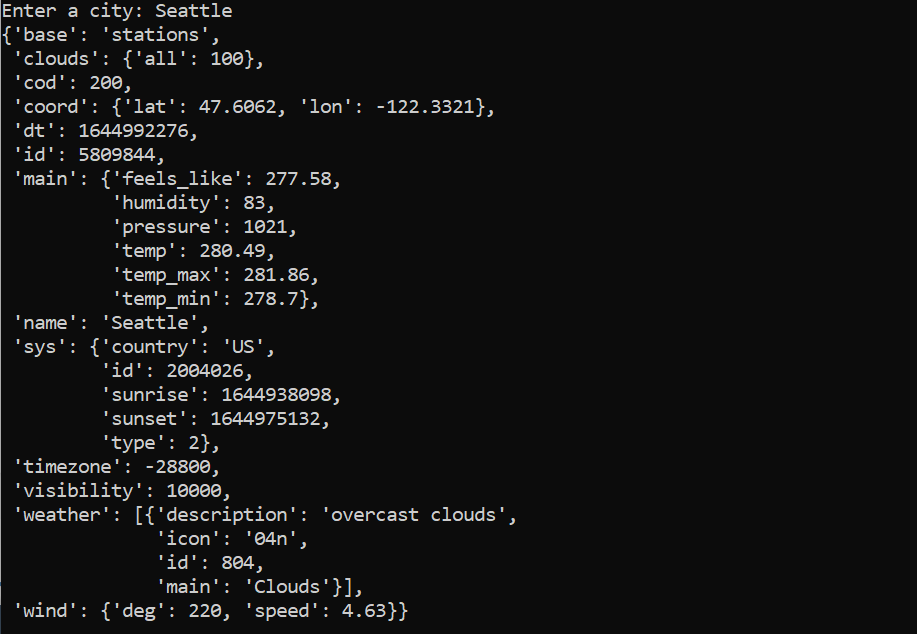

# Climate-Search

# Description
This program asks user to enter a location as input, then collects data from OpenWeather's API and outputs climate details (including temperature, humidity, wind, cloud, visibility, etc.) of the chosen location on screen. 

# Prerequisite
Need dependecy: python Requests library. \
We will use its built-in methods to make Http requests.\
To install Requests, run this command line in your terminal: \
```pip install requests```

# How to run
simply run ```python climate_search.py```

# Program in Action
This is how it looks like when you run the program (I searched Seattle and Tokyo):

\
How's the weather of your city?
